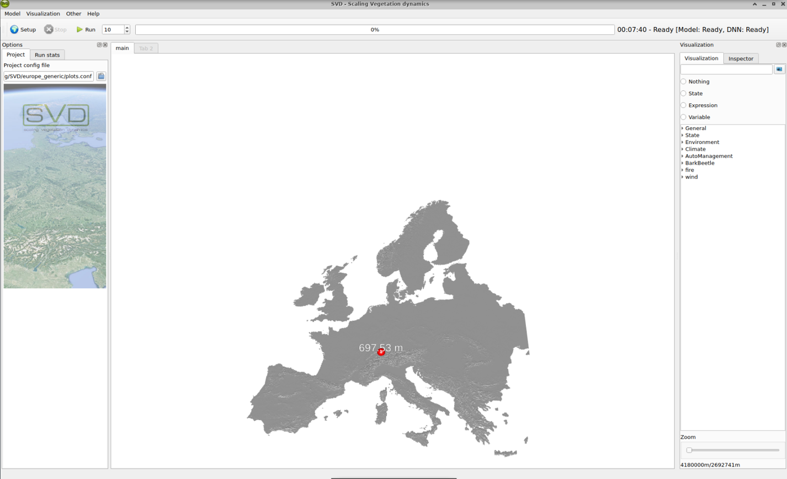
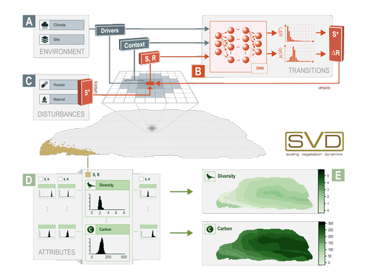

# SVD Documentation
*Scaling vegetation transitions*

SVD is a modeling framework for the simulation of vegetation transitions on larger spatial scales.
It is a [research tool](svd_papers.md) and released under a GPL open source license. 

## Installation
*  [Installation guide](install.md)

## Using SVD
* [SVD user interface](svdUI.md)
* [SVDc console version](svdc.md)
* [Guide to input data preparation](SVD_data_preparation.md)

## Setup of a project
* [SVD setup](svd_setup.md)
* [Configuring the landscape](configuring_the_landscape.md)
* [DNN setup](dnn_setup.md)
* [Configuring DNN meta data](configuring_dnn_metadata.md)

## SVD concepts
* [States](states.md)
* [Modules](modules.md)
  * [Fire module](module_fire.md)
  * [Matrix module](module_matrix.md)
  * [Wind module](module_wind.md)
  * [Management module](module_management.md)

## Reference documentation
* [configuration file](project_file.md)
* [SVD Outputs](outputs.md)
* [variables and expressions](variables.md)
* [data formats in SVD](SVD_data_formats.md)

