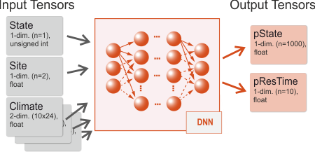

SVD integrates [ONNX Runtime](https://onnxruntime.ai/) and allows thus to run
any trained Deep Neural Network (in `.onnx` format) within the framework.
A conceptual view is depicted below: 



The network architecture of the DNN defines not only the layers of the network,
but also the shapes and types of the input and output data. SVD 
adopts a "multiple-inputs/multiple-outputs" model, where a single network
is trained to be fed simultaneously with data from multiple inputs, and provides multiple outputs as result.
Typical inputs are the current state and residence time of a cell, climate and site conditions, typical
outputs are a probability distribution for the next state S*, and a distribution for the time until state change.

Each of this inputs and outputs is (in Deep Learning lingo) a tensor, i.e. a multidimensional array of data
with a given shape (the number of dimensions and the size along each axis of the tensor) and type (the internal
data type of the tensor, for example floating point or integer). The input/output data needs to comply with the
definition of the tensors both during the training and inference phase.

In order to integrate (an existing) DNN with SVD one needs to:

* define each input tensor (name, shape, data type)
* define which data items should be fed into the tensors during a SVD simulation
* further define potential transformation of those data items (often data is scaled or otherwise transformed for better DNN performance)

## Input tensors

SVD includes a flexible mechanism to define input tensors and provides several pre-defined and user defined 
input "slots". The input tensors are defined in a configuration file which is set by the `dnn.metadata` setting.

Here is an example of a pre-defined slot:
```
# defines the tensor "climate" with data type "float" 
# and 2 dimensions (10 years x 24 values per year).
# The slot is "Climate" 
input.climate.enabled=true
input.climate.dim=2
input.climate.sizeX=10
input.climate.sizeY=24
input.climate.dtype=float
input.climate.type=Climate
```

SVD detects the pre-defined type `Climate` and sets up a link to the available climate data in the model. The 
name of the tensor is `climate` (as in `input.climate`), and the data is a 2-dimensional matrix with 10x24 values.
For each cell that should be processed by the DNN SVD populates the tensor with climate
data for the next 10 years (in this case the time series consists of 24 values per year).

Another example with user defined input data:

```
# defines the tensor "site" with data type "float"
# and 1 dimension (2 values)
# The type is "Var" 
input.site.enabled=true
input.site.dim=1
input.site.sizeX=2
input.site.sizeY=0
input.site.dtype=float
input.site.type=Var
input.site.transformations={availableNitrogen/100}, {pctSand/100}
```
In this case SVD fills for each cell the two variables in the input tensor 
with `availableNitrogen/100` and `pctSand/100`. `availableNitrogen` and `pctSand` need to be
available in the model (e.g. provided as environment variables in `landscape.file`). Note that
the data values are transformed on the fly. The name of the tensor is `site`. 

A more detailed description of the available input slots is given on the [DNN metadata](configuring_dnn_metadata.qmd) page.

## Output Tensors & Top-K Modes

SVD expects two main output targets from the DNN:

1. **State Prediction**: Candidate future states and their probabilities (Top-K states).
2. **Residence Time**: A probability distribution for the time until state change (typically the result of a `Softmax` layer specified via `dnn.restime.name` and `dnn.restime.N`).

For state prediction, SVD supports two execution modes for Top-K extraction:

### Mode 1: CPU Top-K Mode (`dnn.state.name`)

In CPU mode, the ONNX model outputs the full probability distribution over all possible state classes (typically a `Softmax` layer of shape `[batch, num_states]`).

* **Configuration**:
  ```ini
  dnn.state.name = output_state  # Tensor name for full state probability distribution
  dnn.state.N = 1418               # Total number of state classes
  dnn.topK.N = 10                  # Number of top candidate states to extract
  ```
* **Execution**: SVD extracts and filters the `dnn.topK.N` most likely candidate states on the CPU.
* **DNN Training & Setup**: Standard model training and export without modifying the network output layers. Recommended for quick testing with existing models.

### Mode 2: GPU Top-K Mode (`dnn.topK.state.name` and `dnn.topK.prob.name`) — *Recommended for High Performance*

In GPU mode, the Top-K selection operator is embedded directly inside the ONNX model graph (via an ONNX `TopK` node). The GPU computes the Top-K candidate states in CUDA VRAM during inference and outputs two compact tensors: Top-K state IDs and Top-K probabilities.

* **Configuration**:
  ```ini
  dnn.topK.state.name = State_TopK:1  # Tensor name for Top-K state IDs (INT16, INT32, INT64, or FLOAT)
  dnn.topK.prob.name = State_TopK:0   # Tensor name for Top-K probabilities (FLOAT)
  dnn.topK.N = 10                     # Number of top candidate states returned by GPU
  ```
* **Execution**: SVD reads Top-K results directly from GPU memory with zero CPU sorting overhead and **99% reduced PCIe data transfer** (achieving throughput over 450,000 cells/sec).
* **DNN Training & Setup**:
  1. **Training**: Train your neural network model as usual with standard Softmax / Cross-Entropy loss.
  2. **Model Export**: Before exporting to `.onnx`, append a `TopK(k=10)` operator (e.g. `tf.nn.top_k` in TensorFlow, `torch.topk` in PyTorch, or via the `onnx` Python helper) to the state output layer.
  3. **SVD Setup**: Configure `dnn.topK.state.name` and `dnn.topK.prob.name` in your project file.

