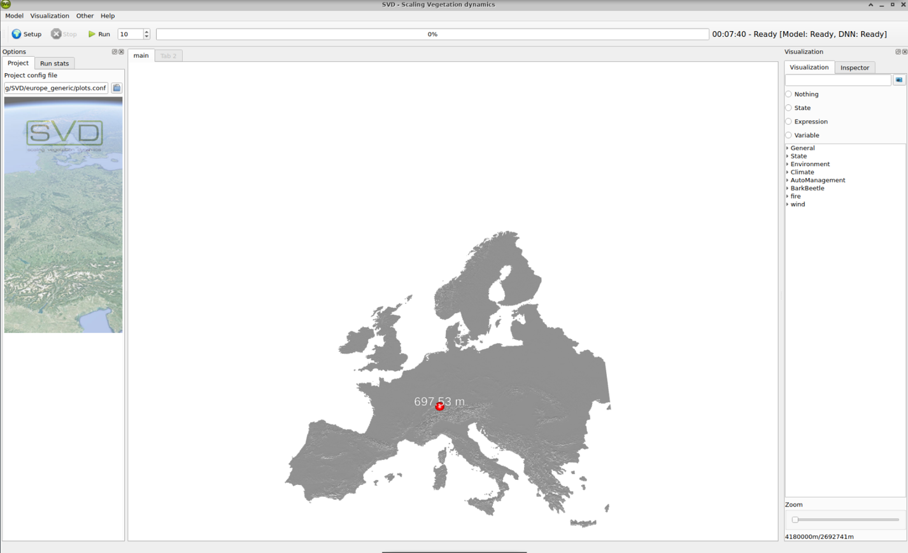
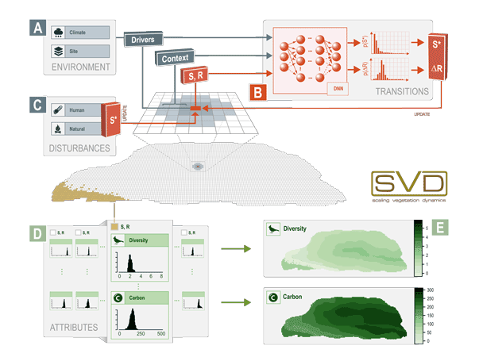

*Scaling vegetation transitions*

SVD is a modeling framework for the simulation of vegetation transitions on larger spatial scales.
It is a [research tool](svd_papers.qmd) and released under a GPL open source license. 

## Installation

*  [Installation guide](install.qmd)

## Using SVD

* [SVD user interface](svdUI.qmd)
* [SVDc console version](svdc.qmd)
* [Guide to input data preparation](SVD_data_preparation.qmd)

## Setup of a project

* [SVD setup](svd_setup.qmd)
* [Configuring the landscape](configuring_the_landscape.qmd)
* [DNN setup](dnn_setup.qmd)
* [Configuring DNN meta data](configuring_dnn_metadata.qmd)

## SVD concepts

* [States](states.qmd)
* [Modules](modules.qmd)
  * [Fire module](module_fire.qmd)
  * [Matrix module](module_matrix.qmd)
  * [Wind module](module_wind.qmd)
  * [Management module](module_management.qmd)

## Reference documentation

* [configuration file](project_file.qmd)
* [SVD Outputs](outputs.qmd)
* [variables and expressions](variables.qmd)
* [data formats in SVD](SVD_data_formats.qmd)

