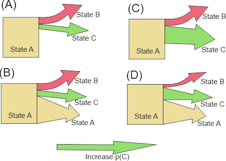

# Matrix module

## Transition matrix

The transition matrix used by the module is loaded from `transitionFile` and has the following columns:

| Column     | Desription                                                          |
|------------|---------------------------------------------------------------------|
| stateId    | The [Id](states.md) of the current state                            |
| key        | an additional qualifier (see text)                                  |
| targetId   | The [Id](states.md) of the target state                             |
| p          | The probability (0..1) of a transition from `stateId` to `targetId` |
| pmin       | Minimum probability (0..1), (not mandatory)                         |
| pmax       | Maximum probability (0..1), (not mandatory)                         |
| expression | expression to condition probabilities on data                       |

The probabilities `p` need to sum up to 1 for every unique combination of `stateId` and `key`. The `key` allows the definition of (many) alternative transition probabilities for the same state.

Consider the following (constructed) example, where the transition probabilities depend on an environment variable "soilDepth" and are different for shallow soils (soilDepth \< 30cm). The table below shows a transition matrix for shallow, and deep soils (note that for state 2 and shallow soils the state does not change):

| State | p(State 1) | p(State 2) | p(State 3) | Soildepth |
|-------|------------|------------|------------|-----------|
| 1     | 0%         | 20%        | 80%        | \<30cm    |
| 1     | 0%         | 40%        | 60%        | \>=30cm   |
| 2     | 0%         | 100%       | 0%         | \<30cm    |
| 2     | 10%        | 80%        | 10%        | \>=30cm   |
| ...   | ...        | ...        | ...        | ...       |

Converted to the "long" format used by the module, the table looks like:

| stateId | key | targetId | p   |
|---------|-----|----------|-----|
| 1       | 0   | 2        | 0.2 |
| 1       | 0   | 3        | 0.8 |
| 1       | 1   | 2        | 0.4 |
| 1       | 1   | 3        | 0.6 |
| 2       | 0   | 2        | 1   |
| 2       | 1   | 1        | 0.1 |
| 2       | 1   | 2        | 0.8 |
| 2       | 1   | 3        | 0.1 |
| ...     | ... | ...      | ... |

The information whether a cell has shallow or deep soil, can be derived from the environment (assuming there is a variable `soilDepth`) and can be expressed as an [expression](variables.md) (`keyFormula`):

`if(soilDepth<30, 0, 1)`

### Deterministic transitions

If for a given state several `targetIds` are provided, then the target state is chosen based on the provided probabilities. Deterministic transition based on some criterion (e.g. change from state 1 to state 2 after 20 years) can be simulated by setting the probabilities `p` to 1 and by expressing the criterion as an expression for different `keys` (as long as the required variables are available). For example, the expression `min(residenceTime/10, 10)` yields the decade (0: 0-9yrs, 1: 10-19yrs, ...), which can be used as `key` in the transition matrix:

| stateId | key | targetId | p   | comment                        |
|---------|-----|----------|-----|--------------------------------|
| 1       | 0   | 1        | 1   | 0-9 years, no change           |
| 1       | 1   | 1        | 1   | 10-19 years, no change         |
| 1       | 2   | 2        | 1   | \>=20 years, change to state 2 |

### Conditional transitions

The probability of a transition from one state to another need not to be constant, but can depend on environmental data, or on the local neighborhood. For example, a transition could be more probable, if local site conditions allow faster growth (e.g., difference in soil depth), or if specific species are available in the neighborhood (e.g. seed input). Such dependencies can be expressed by using [expressions](variables.md).

Expressions can be provided in the `expression` column in the `transitionFile`. Expressions can make use of all available variables, and functions (e.g., for querying the state of neighboring cells). The result of the expression modifies the transition probability provided in the file.

#### Scaling probabilities

The result of an expression either scales directly the probability `prob`, or is used to calculate a probability between `pmin` and `pmax`.

Direct scaling happens when no values for `pmin` and `pmax` are given. In this case the resulting probability is calculated as the product of base probability and the result of the expression (note that the expression increases the probability with values \> 1):

$$
p_{eff} = prob \cdot f_{expr}(x)
$$

Otherwise (`pmin` and `pmax` provided), the result of the expression is limited to [0 .. 1] and used as a linear ramp between min and max:

$$
p_{eff}=p_{min} + (p_{max}-p_{min}) \cdot f_{expr}(x)
$$

Note that in this case the value of `prob` is not used.

#### Modes of scaling

Altering the probabilities of individual transitions affects also other transitions originating from the same state. SVD allows two modes how this is done. The following image illustrates the difference:

In case (A) the `transitionFile` contains transitions for states `B` and `C`, but none for `A`. SVD assumes that remaining in state `A` is the default with p=1-(pB + pC). In case (B) all three transitions are explicitly included in the data file. Now consider the case the the probability of state C is modified (*pCmod*) by an expression (the green arrow). In the former case (now (C)), *pB* and *pCmod* remain unchanged, only *pA* (the probability of remaining state `A`) is altered (in this case: reduced). If all pathways are specified (case (D)), all three probabilities are re-scaled (to 1).

The following tables illustrate the difference numerically. If the values of the expression for states B and C are 0, the probabilities are the same in both cases (pA=0.96, pB=pC=0.02). But if pB and pC are scaled by the expression to 0.12, the results differ: in the upper table (showing case (A)), only pA is affected, in the lower table (illustrating (C)) all probabilities are altered.

*Table. Example when when only changes are provided in the `transitionFile`.*

| State                   | pmin | pmax | p_calc | p_result |
|-------------------------|------|------|--------|----------|
| State A (not provided!) |      |      |        | 0.76     |
| State B                 | 0.02 | 0.15 | 0.12   | 0.12     |
| State C                 | 0.02 | 0.15 | 0.12   | 0.12     |

*Table. Example when all pathways are provided (see figure above)*

| State   | pmin | pmax | p_calc | p_result |
|---------|------|------|--------|----------|
| State A | 0.96 | 0.96 | 0.96   | 0.8      |
| State B | 0.02 | 0.15 | 0.12   | 0.1      |
| State C | 0.02 | 0.15 | 0.12   | 0.1      |

## Handled states

To set the module as handler for specific states, use the module name as the `type` property in the [state](states.md) definition (see [modules](modules.md)).

## Configuration

The module is configured in the [project file](project_file.md).\
In addition to the `enabled` and `type` setting, the matrix module has the following settings:

-   

    ### `transitionFile` (filepath)

    The file containing the data for the transition matrix (see above).

-   

    ### `keyFormula` (expression)

    The `keyFormula` is an expression that can access all cell variables. The result of the expression is used as the `key` in the transition matrix (see above). The value of the expression is converted to an integer (the floating point fraction is truncated, i.e. 1.9 -\> 1). To disable, set to "" or to a constant ("0").
