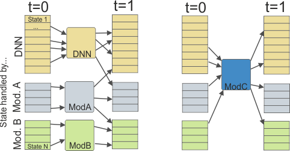

# Modules

The core functionality of SVD is the simulation of state transitions by the means of a Deep Neural Network.
In addition, SVD can be extended with "modules". Modules can be used to:
* extend the range of vegetation types covered by SVD; for instance, if the DNN only covers forest states,
a module could handle other land cover types (e.g. grass land or agricultural land)
* implement additional processes such as disturbances or forest management; the DNN could be used 
for "slow" forest dynamics, while abrupt changes (e.g. wildfire) are imposed by modules
* implement parts of the life cycle that are not covered by the DNN; for example, if a DNN is only trained 
to estimate regeneration probabilities after a disturbance, a module can be used to establish a simplified
model of vegetation dynamics for other development stages.

## Interaction types
SVD provides two conceptually different ways how modules can interact with the landscape. Modules can
either fully handle specific states (i.e. calculate vegetation transitions for all cells in these states), 
or affect cells in states that are normally handled by a different process / module. The following figure
depicts the difference:



*Left: different states are handled by different modules (DNN, Module A, Module B), right: a module (Module C) affects cells that are handled by
a different process / module.*

In the figure, "Module A" and "Module B" are assigned to handle specific states (blue and green). Note that
only the input of a module is limited to cells with specific states (blue and green). For instance,
cells that are handled by "Module A" (that are currently in a blue state), can transition to "Module B"
(green) or to the main DNN (orange). If, say, the DNN handles forest and "Module A" grass land, then 
the reforestation of a cell would be a transition from a blue to an orange state, and consequently the DNN would 
handle the cell in the future. Note also, that the modules could be totally separated with no transitions 
between different modules.

"Module C" is different (right part of the figure): when the module is executed, it can affect different
cells (orange, green, or blue states) and change their states. Such a module typically represents 
some kind of intervention process, such as disturbances or forest management. 
Note that a state transition caused by the module can also affect the handling module; for example, 
a fire module could change a forested state that is handled by the DNN (orange) to a grass land state (blue).
 
## Supported modules

Modules are configured in the [project file](project_file.md). The specific implementation of a module is chosen
with the `type` setting. The following modules are available:

* ### [`matrix`](module_matrix.md)
State-specific transitions based on a transition probability matrix.
 
* ### [`fire`](module_fire.md)
Wildfire disturbance module that simulates pre-defined events.

* ### [`wind`](module_wind.md)
Wind disturbance module that simulates pre-defined events.

* ### [`bark beetle`](module_barkbeetle.md)
Bark beetle disturbance module that simulates spruce bark beetle dynamics.

* ### [`management`](module_management.md)
Management module that simulates pre-defined events.

## Specifying handling modules for states
To set the module as handler for specific states, use the module name as the `type` property in the
[state](states.md) definition.

For example, consider the following definition of a module `test_matrix`:
```
modules.test_matrix.enabled = true
modules.test_matrix.type = matrix
modules.test_matrix.transitionFile = stm/stm.trans.csv
modules.test_matrix.keyFormula = min(residenceTime/10, 10)
```

To specify that (for example) the states 1 and 2 are handled by `test_matrix` while all other states
are handled by the DNN, update the `type` column in the state input file (note that a blank `type` defaults to DNN):

 stateId | type | (other columns)
---------- | ---- | -----
1 | test_matrix | ...
2 | test_matrix | ...
3 |   | ....
... | ... |....


